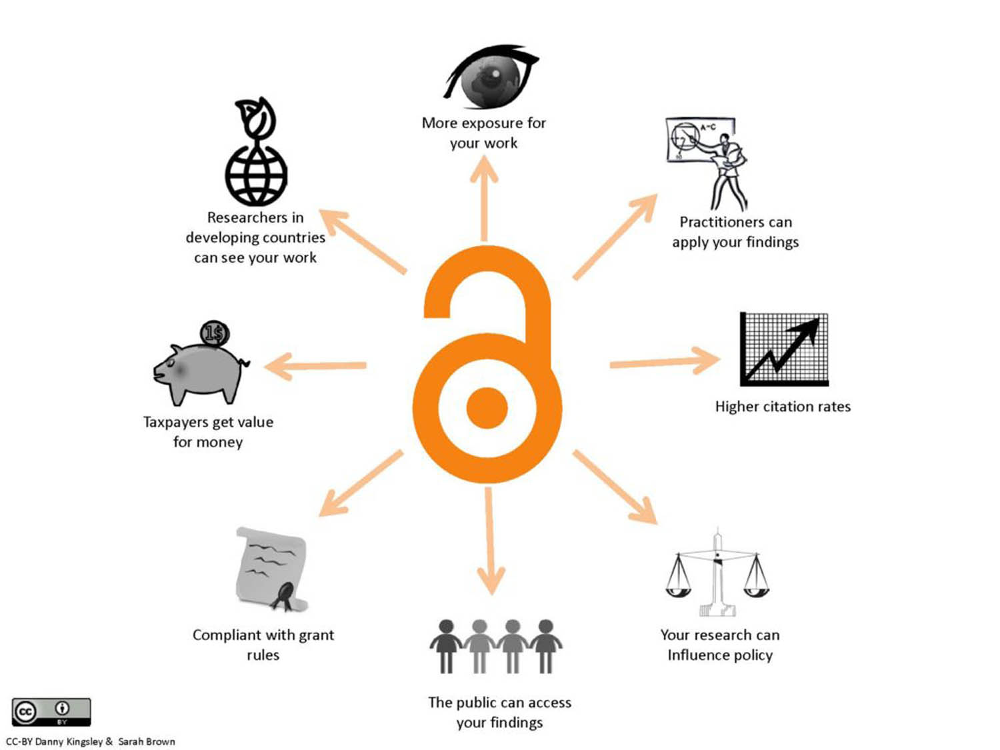

# EpiJournalInMechanics.github.io
The purpose of this letter is to raise awareness among the communities
in Mechanics about epijournal publications.

Problem
=======

How is all this possible? Tomorrow, researchers will have to pay in
order to publish! The Gold Open Access model with Article Processing
Charge (APC) seems to expand rapidly in our community. This publication
process uses a business model based on individual articles for which
their authors pay fees for publication[^1].

Public finances
===============

This model will have dramatic consequences on universities’ and research
institutes’ budgets, and more generally on public finances. For instance
in France, CNRS currently spends about M/year in library resources,
amount that would nicely reach M/year in case Gold Access with APC
becomes the preferred avenue for publishing[^2]. Similar numbers are
provided by McGill’s library concerning the subscription to journals and
electronic resources[^3]. Moreover, the H2020 program promotes open
access in the general sense, with or without APC, but has the harmful
side-effect if there is no alternative but to pay under the Gold Open
Access policy. The fact that APC are eligible expenses to be listed in
proposals of H2020 is a consequence of this ambiguity. Some might think
that APC represent a minor fraction of research expenses. This is
probably true but a publication process free of charges for both authors
and readers (Diamond Open Acess Policy[^4]) is a viable alternative.

Open Access, sustainable research and epijournals
=================================================

As our colleagues in Mathematics, Computer Science and Human Sciences
have already understood[^5][^6], Overlay Journals (also called
epijournals or Diamond Open Access) are the way to go! Overlay journals
are purely open access electronic journals solely fed by articles that
are deposited on open archives (arXiv, HAL, engrXiv...) and not already
published elsewhere. The review procedure, undertaken by the editorial
team of the overlay journal together with designated reviewers, is of
high quality[^7]. This virtuous framework involves a minimal cost to
society and taxpayers while publications (and possibly attendant data)
are always openly accessible on the long term. Technical challenges are
minimal since appropriate platforms already exist. As an example, the
Episciences initiative[^8] provides technical support for peer-reviewing
activities which are supervised by editorial boards. To summarize,
epijournals add value to open archives by assigning a scientific caution
to the accepted papers. Other benefits of *free* Open Access[^9] are
summarized in Figure [fig:OA].

[fig:OA]

And the mechanics community? 
============================

It is now critical that the mechanics community thinks about a full open
access model to publish the outcomes of research, and more specifically
about the creation of Overlay Journals in various subfields of
Mechanics. Lately, this question generated a strong interest as it is
witnessed by the fruitful discussion on Loomio, an online tool
increasing transparency and inclusion, to reach decisions[^10].

Next steps and questions to the Scholarly Society
=================================================

An international editorial team should now be created. It is highly
recommended that Scholarly Societies get involved in the creation of
Epijournals and blow a wind of change able to completely redraw the
arcane of publishing. Also, we would like the point of view of the
society on the following questions:

-   Would the Society position itself as a proponent of alternative
    publication processes based on epijournals?

-   Would the Society be able to support an initiative for creating an
    epijournal in Mechanics?

-   Could the Society suggest members to the editorial board of the
    epijournal to be created?

-   Would the Society be willing to help implement the launch of the
    such a journal by encouraging the submission of papers after
    international conferences and workshop administered by the society?\

On behalf of the Loomio members supporting the creation of Epijournals
in Mechanics,\
Vincent Acary, INRIA, France\
Mathias Legrand, McGill University, Canada

[^1]: [Definition of APC on
    Wikipedia](https://en.wikipedia.org/wiki/Article_processing_charge)

[^2]: [DIST Etude 2015 assuming that all CNRS authors will pay for their
    contributions.](http://www.cnrs.fr/dist/z-outils/documents/Distinfo2/DISTetude_4.pdf)

[^3]: [2016 Annual Report, page
    13](http://www.mcgill.ca/library/files/library/mcgill_library_and_archives_-_annual_report_2016_0.pdf)

[^4]: [Definition of Diamond Access
    Policy](https://en.wikipedia.org/wiki/Open_access_journal)

[^5]: [List of Mathematical Journals that apply a Diamond Open Access
    policy](https://www.cimpa.info/en/node/62)

[^6]: [épisciences.org Overlay
    Journals](https://www.episciences.org/page/journals)

[^7]: [Discussion on the Discrete Analysis Overlay Journal in
    Mathematics](http://discreteanalysisjournal.com/articles and its announcement by Nature https://www.nature.com/news/leading-mathematician-launches-arxiv-overlay-journal-1.18351)

[^8]: [épisciences.org Website](https://www.episciences.org/?lang=en)

[^9]: We call “free Open Access”, a publication model free of charges
    for both authors and readers or equivalently the Diamond Open Acess
    Policy

[^10]: [Loomio discussion on Overly Journals in
    Mechanics](https://www.loomio.org/invitations/aa0a97be9a80ba509623)

